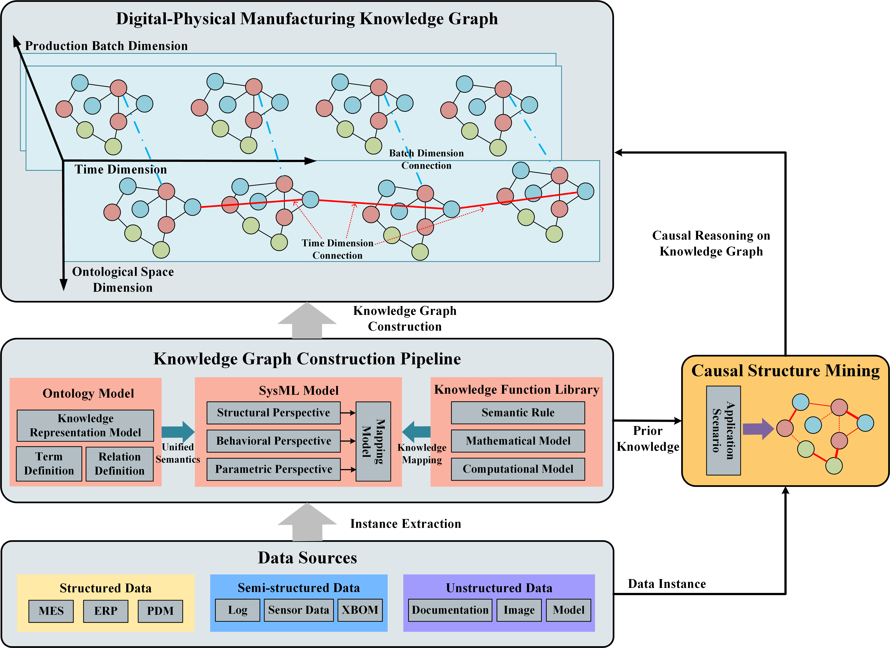

# DPMKG: Digital-Physical Manufacturing Knowledge Graph

This repository provides an implementation of DPMKG described in the paper: A knowledge graph construction and causal
structure mining approach for non-stationary manufacturing systems

## Abstract

Knowledge graph (KG) is a method for managing multi-source heterogeneous data and forming knowledge for reasoning using
graph structure. It has been extensively utilized in manufacturing systems to promote the advancement of intelligent
manufacturing. In non-stationary manufacturing systems, the machining performance of individual elements demonstrates
variability and dynamic fluctuations. The significant dynamics and uncertainties of a manufacturing system bring great
challenges to KG's modeling, construction, and reasoning. To overcome these challenges, this paper proposes a
Digital-Physical Manufacturing Knowledge Graph (DPMKG) construction and reasoning method. Firstly, an ontology-based
knowledge representation model is developed to facilitate the integration of digital domain knowledge with the
description of physical domain performance fluctuations, thereby establishing the schema layer of DPMKG. Secondly, a
SysML model-driven construction pipeline is proposed to facilitate the correlation and integration of multi-source data
from both digital and physical domains, thereby establishing the instance layer of DPMKG. Thirdly, a causal structure
mining method for DPMKG is developed to enhance the analytical and reasoning capabilities in non-stationary
manufacturing systems. Finally, an aero-engine casing machining system is employed as a case study to establish the
DPMKG, and reasoning is performed on the process quality prediction task. The case study reveals that the proposed DPMKG
modeling, construction, and reasoning approach can effectively describe and analyze performance fluctuations in the
physical domain of a non-stationary manufacturing system. By integrating digital and physical domain knowledge, the
extensive data can be effectively leveraged to generate knowledge for reasoning, thereby facilitating intelligent and
refined control of non-stationary manufacturing systems.

